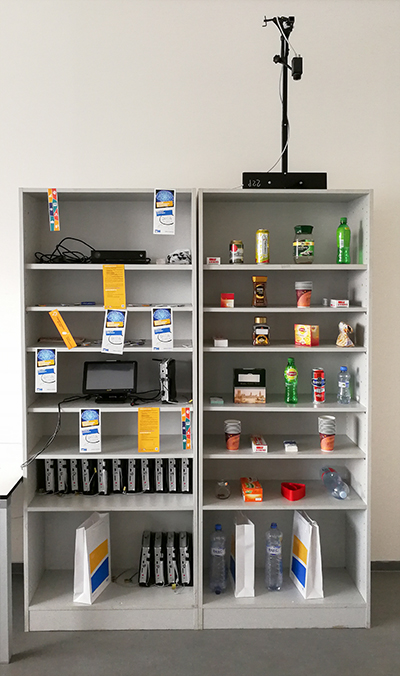
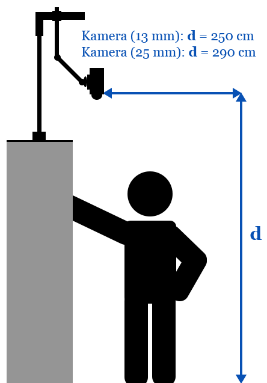

# Bachelor thesis text sources for Detection of products in hand by IR camera

This repository contains TeX sources and generated [PDF output](thesis.pdf) related to my Bachelor thesis. The work was done in the Improlab (https://improlab.fit.cvut.cz/) at FIT CTU in Prague and the IR camera used was FLIR A65. The thesis is written in Czech language. Final presentation could be found [here](presentation.pdf). 

There were 3 desktop applications created as part of the thesis:
* Main application with all detection and processing algorithms which was also used as client recieving raw temperature data from FLIR camera (using modified eBUS Player) - https://github.com/lukasbrchl/Detection-of-products-in-hand-by-IR-camera.
* FLIR A65 raw image viewer which also have functionality to label images - https://github.com/lukasbrchl/FLIR-camera-image-viewer-and-labeling.
* Modified eBUS Player which allows to read raw temperature data from GigE cameras and send them through the socket - https://github.com/brchlluk/Modified-eBUS-Player.

  

